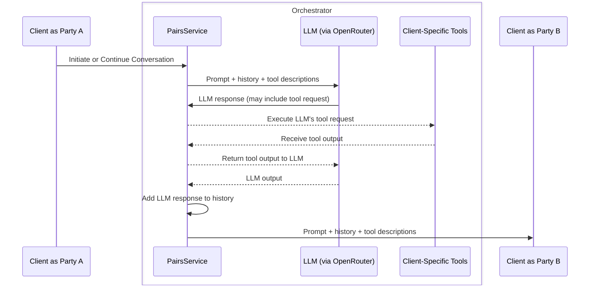
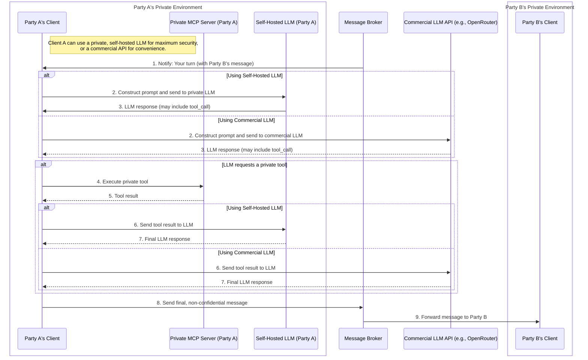
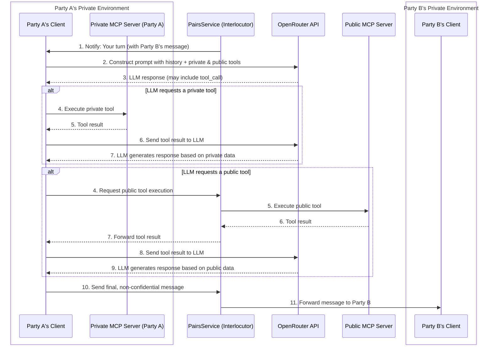

# Architectural Diagrams of Agentic Systems

This document contains Mermaid diagrams illustrating the different agentic architectures we've discussed.

## 1. The Banterop Architecture ("God View" Orchestrator)

This diagram shows the current architecture of the Banterop application, where the central `PairsService` has a "god view" of the entire conversation and all tool calls.

## 2. Secure, Client-Side Architecture

This diagram illustrates the secure, client-side architecture where each party is responsible for its own private data and tool calls. The central service acts only as a message broker.

## 3. Hybrid Architecture (Client-Side Private Tools, Centralized Public Tools)

This diagram shows a hybrid model. The central `PairsService` manages the main conversation and public tools, but each client is responsible for executing its own private tools. This is a practical compromise that balances security and convenience.

